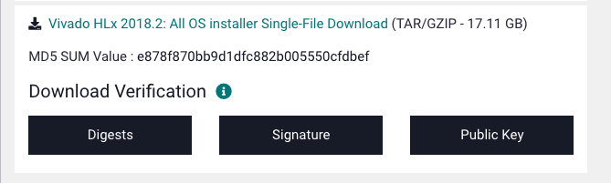

It is possible to use Vivado on Mac.

### Setup
#### Installing Vivado
First, create a vagrant box running Ubuntu 16.04. **box/Vagrantfile** already contains the working configurations needed for this.

```
cd box
vagrant plugin install vagrant-disksize
vagrant up
```

Then download Vivado 2018.2 from the "All OS install Single-File Download" section, and extract it into **shared/install**.



Now ssh into the vagrant box and run the install script.

```
vagrant ssh
cd /shared/install
chmod +x install.sh
./install.sh
```

Once this is done you can delete the Vivado folder extracted earlier.

#### A few more things
Maybe these should be in the install script, but I only added this later and didn't want to test.

These libraries should be installed for the Vivado GUI features (to export schematic and run simulation) to work.

```sh
sudo apt update
sudo apt install -y libxrender1 libxtst6 libxi6 
```

Link the `gcc` that came installed with Vivado to **/usr/bin** because it will be needed when running simulations.

```sh
sudo ln -s /opt/Xilinx/Vivado/2018.2/lnx64/tools/gcc/bin/x86_64-unknown-linux-gnu-gcc /usr/bin/gcc
```

There might be issues with the locales, to be safe add these lines into **~/.bash_profile**.

```sh
export LANG=en_US.UTF-8
export LANGUAGE=en_US.UTF-8
export LC_ALL=en_US.UTF-8
```

And to use the Vivado command line tools, also add these lines into **~/.bash_profile**.

```sh
source /opt/Xilinx/Vivado/2018.2/settings64.sh
export LIBRARY_PATH=/usr/lib/x86_64-linux-gnu:$LIBRARY_PATH
```

#### X11 Forwarding
Since the vagrant box is configured without a GUI, but we may want to use Vivado's GUI, we can forward it to our host machine using [XQuartz](https://www.xquartz.org/).

Usage is quite straightforward. Just open XQuartz and run the GUI program inside vagrant, then the GUI will be automatically forwarded to the host machine.

That should be all. I think.

